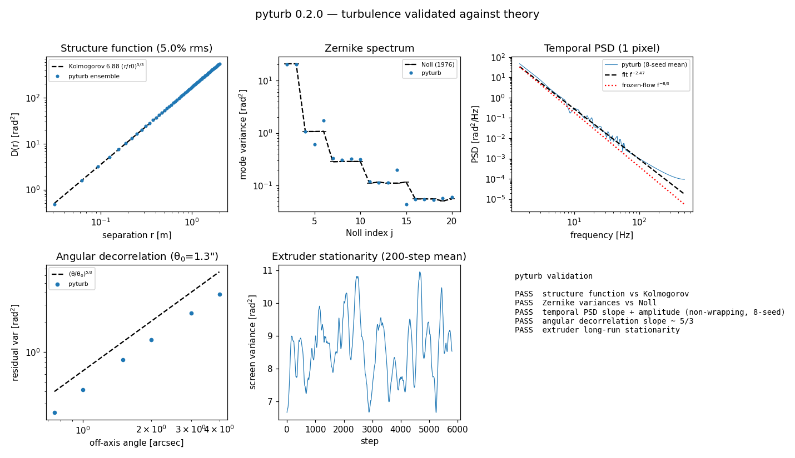

# Validation

pyturb's turbulence is checked against analytic theory, not just asserted to be
correct. `validation/validate.py` regenerates the figure below and prints a
PASS/FAIL for each check against its tolerance; it runs in a few seconds and is
suitable for CI.

```bash
python validation/validate.py
```



## What each panel shows

**Structure function vs Kolmogorov.** The azimuthally-averaged phase structure
function of an ensemble of FFT screens (subharmonic-corrected) matches
`D(r) = 6.88 (r/r0)^{5/3}` to a few percent across the inertial range at
separations of a few pixels and up — the core check that the spatial statistics
are right. The 1-2 pixel (near-Nyquist) scales show a larger deficit (order
5-10%) from finite grid sampling, so read the "few percent" figure with a
>~2-4 pixel resolution qualifier at the shortest scale of interest.

**Zernike spectrum vs Noll (1976).** Screens are decomposed with
`pyturb.analysis.zernike_decompose` and the per-mode variances compared to the
Kolmogorov values `Δ_{j-1} − Δ_j` of Noll. The aggregate over modes agrees to
~10%. (Finite screens under-sample tip/tilt, and a square grid splits the two
astigmatism modes — both are real sampling effects, visible as the small
per-mode scatter.)

**Temporal PSD.** The time series of a single pupil pixel under frozen flow
follows the `f^{-8/3}` power law in the inertial regime; the bumps are the
wind-crossing harmonics of the finite aperture. Fit with
`analysis.temporal_psd` + `analysis.fit_power_law`.

**Angular decorrelation.** The residual variance between the on-axis and an
off-axis line of sight grows as `(θ/θ0)^{5/3}` near the isoplanatic angle
(`analysis.differential_variance`), confirming the geometry of the off-axis
`directions=` path. Well beyond θ0 the curve saturates as the two footprints
fully decorrelate.

**Extruder stationarity.** The variance of an `InfinitePhaseScreen` shows no
secular drift over thousands of steps (guarding against conditional-covariance
error accumulation). The fast wiggle is the physical beating of the few
large-scale modes a small screen contains, not drift.

## Reproducing

The script uses only pyturb, NumPy and Matplotlib, and by default writes
`docs/images/validation.png`. For CI or an experiment, keep generated evidence
out of the worktree with `--output` and record the per-check results with
`--metrics`:

```bash
python validation/validate.py --output /tmp/validation.png \
    --metrics /tmp/validation.json
```

The JSON records the command, UTC generation time, installed pyturb version,
and GitHub Actions revision (or the local Git commit when available), alongside
the individual check results. A `source_dirty` flag makes it clear when a local
artifact was produced from uncommitted source changes.

Every check is an ensemble comparison to a closed form, so re-running with a
different seed gives the same conclusions within the stated tolerances. The
same primitives (`pyturb.analysis`) are available to build your own diagnostics
— see [interop](interop.md).
