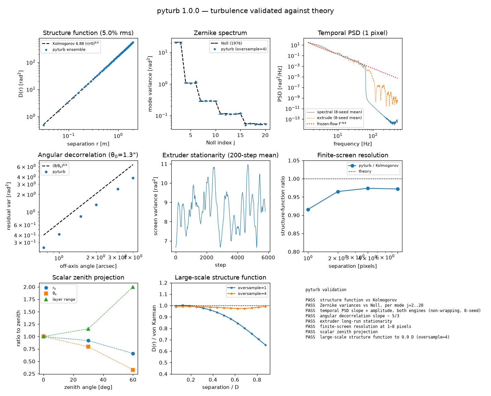

# Validation

pyturb's turbulence is checked against analytic theory, not just asserted to be
correct. `validation/validate.py` regenerates the figure below and prints a
PASS/FAIL for each check against its tolerance; it runs in a few seconds and is
suitable for CI.

```bash
python validation/validate.py
```



## What each panel shows

**Structure function vs Kolmogorov.** The phase structure function (averaged
over both array axes) of an ensemble of FFT screens (subharmonic-corrected)
matches `D(r) = 6.88 (r/r0)^{5/3}` to ~5% rms over separations from 4 pixels to
a quarter of the screen — the core check that the inertial-range statistics are
right. The 1-2 pixel (near-Nyquist) scales show a larger deficit (order 5-10%)
from finite grid sampling, so quote the figure with a >~2-4 pixel resolution
qualifier at the shortest scale of interest.

**Large-scale structure function.** An FFT screen is periodic, so on the
default pupil-sized screen (`oversample=1`) opposite pupil edges are
neighbours: the structure function is about −13% at `D/2` and ~0.65x theory
near `0.9 D`, tilt is ~10-15% low, and the two astigmatisms split (~0.6x and
~1.6x Noll). `Atmosphere(oversample=4)` puts the pupil inside a 4x screen and
matches von Kármán `2[C(0) − C(r)]` to ~2% rms out to `0.9 D`, which is what
the check asserts; the default curve is plotted for comparison. Use
`oversample` (it grows the FFT as `oversample**2`; see
[Choosing an engine](engines.md)) when
statistics across the whole pupil matter: tip/tilt and low-order error
budgets, long-baseline correlations.

**Zernike spectrum vs Noll (1976).** Kolmogorov screens on a 4x oversampled
grid are decomposed with `pyturb.analysis.zernike_decompose`, and every mode
j = 2..20, tip and tilt included, must sit within 0.8-1.25x of Noll's
`Δ_{j-1} − Δ_j` (measured: 0.89-1.09).

**Temporal PSD.** The time series of a single pupil pixel under frozen flow,
on both engines, follows the `f^{-8/3}` power law at the level
`0.0774 r0^{-5/3} V^{5/3} f^{-8/3}` (spectral: slope −2.63, 1.2x; extrude:
slope −2.81, 0.8x, its sub-pixel interpolation trimming the top of the band).
`analysis.temporal_psd` tapers with a Hann window by default: an untapered
periodogram of a spectrum this steep leaks power upward, reading ~−2.2 to
−2.5 and 2-6x too high. The bumps are the wind-crossing harmonics of the
finite aperture.

**Angular decorrelation.** The residual variance between the on-axis and an
off-axis line of sight grows as `(θ/θ0)^{5/3}` near the isoplanatic angle
(`analysis.differential_variance`), confirming the geometry of the off-axis
`directions=` path. The check asserts the **slope**; the measured level sits
below the infinite-outer-scale `(θ/θ0)^{5/3}` (about ×0.6 here), as expected
for a finite `L0 = 25 m`, which removes large-scale power from the
differential wavefront. Well beyond θ0 the curve saturates as the two
footprints fully decorrelate.

**Extruder stationarity.** The variance of an `InfinitePhaseScreen` shows no
secular drift over thousands of steps (guarding against conditional-covariance
error accumulation). The fast wiggle is the physical beating of the few
large-scale modes a small screen contains, not drift.

**Finite-screen resolution.** The structure-function/theory ratio at 1, 2, 4,
and 8 pixels makes the documented near-Nyquist finite-grid deficit explicit;
the resolved 4–8 pixel scales remain close to theory.

**Zenith projection.** The scalar airmass approximation is checked directly:
`r0` scales as `cos(z)^(3/5)`, layer range as `sec(z)`, and therefore `theta0`
as `cos(z)^(8/5)`. This validates the implemented scalar model, not an
anisotropic slant-path coordinate transform.

## Reproducing

The script uses only pyturb, NumPy and Matplotlib, and by default writes
`docs/images/validation.png`. For CI or an experiment, keep generated evidence
out of the worktree with `--output` and record the per-check results with
`--metrics`:

```bash
python validation/validate.py --output /tmp/validation.png \
    --metrics /tmp/validation.json
```

The JSON records the command, UTC generation time, installed pyturb version,
and GitHub Actions revision (or the local Git commit when available), alongside
the individual check results. A `source_dirty` flag makes it clear when a local
artifact was produced from uncommitted source changes.

Every check is an ensemble comparison to a closed form, so re-running with a
different seed gives the same conclusions within the stated tolerances. The
same primitives (`pyturb.analysis`) are available to build your own diagnostics
— see [interop](interop.md).
